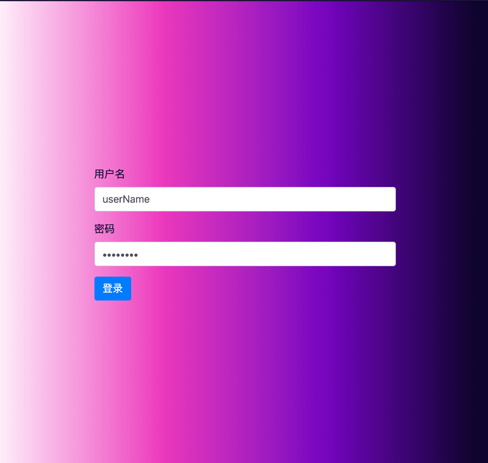
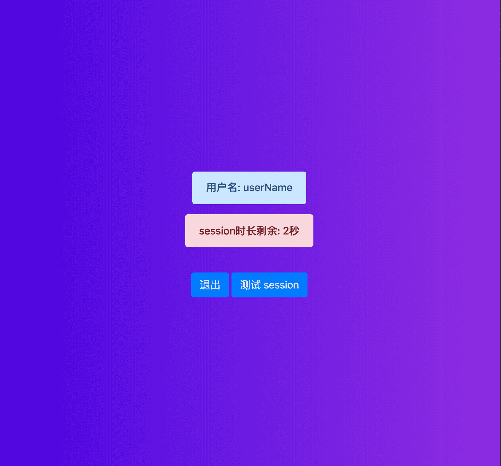

## Session 的简单使用 {docsify-ignore}

### Why

> 默认情况下, Express 请求是顺序的, 并且任何请求相互之间都没有联系, 无法知道此请求是否来自先前已经执行过请求的客户端, 除非使用某种可行的机制, 否则无法识别用户, 那就是`session`

> HTTP 是无状态的, 为了将一个请求与其他任何请求相互管理, 需要一种在 HTTP 请求之间存储用户数据的方法, `Cookies` 和 `URL`参数都是在客户端和服务端之间传输数据, 但它们又是既可读又存储在客户端, `Session`正事为了解决这个问题, 为客户端分配一个`ID`将使用 `ID`发出所有其他请求, 与客户端管理的信息存储在链接到该`ID`的服务器上

### What

> Session 是用于保持状态的基于`WEB` 服务器的方法, `Session`允许通过将对象存储在`WEB`服务器的内存中在整个用户会话过程中保持任何对象. 咋人机交互中, 会话管理是在与计算机系统进行交互的各个会话中跟踪用户活动的过程. 会话管理是`web`开发人员用来使无状态`HTTP`协议支持会话状态的技术, 例如一旦用户通过了 `WEB`服务器的身份验证, 该用户的下一个`HTTP`请求就不应使`WEB`服务器再次询问该用户的账号和密码

> `参考`[wiki](<https://en.wikipedia.org/wiki/Session_(computer_science)>)

### How

[完整代码](https://github.com/niexiaofei1988/learning/tree/master/examples/express/session)

> 使用 express 搭建一个简易的`session`校验机制, 这里使用 [express-session](https://github.com/expressjs/session#readme)由`Express`团队维护

```bash
mkdir session & cd session
npm init -y

npm install -S express express-session body-parser morgan ejs uuid
npm install -D typescript chalk ts-node nodemon @types/node
```

> 初始化, 安装好之后就先查看我们需要做的一些东西, 只是为了测试使用 `session`的操作, 不需要有太多的页面. 一个`登录页 login` 和一个 `首页 index`(登录成功后跳转至首页), 请求层用 `axios`默认不做任何修改

- 判断`session`是否有, 没有就跳转登录页, 有就保持现状
- `登录页`: 默认有 `userName` 和 `password`(不加密 / 或后续尝试)
- `首页` 显示有`session`超时剩余时间 和 `退出登录` 和一个 `session` 超时后的测试按钮

> 大致功能已经描述完了, 比如开发时, 功能需求已经接收清楚, 那么下边就开始干吧! 先看下目录文件

```md
.
├── config.ts # 配置
├── index.ts # 入口文件
├── package.json
├── routes # 路由
│   ├── index.ts # 页面 及 测试 session 接口
│   └── login.ts # 登录 / 退出
├── tsconfig.json
└── views # 页面
├── index.ejs # 首页
└── login.ejs # 登录
```

- > 首先需要设置一下模板引擎, 解析`post`请求, 和 `session` 的中间件及路由的设计, 这里路由访问页面是放在 `routes/index` 而登录和退出接口放在 `routes/login`文件中

```ts
import uuidv1 from "uuid/v1";
import express from "express";
import morgan from "morgan";
import bodyParser from "body-parser";
import path from "path";
import session from "express-session";

import { port, maxAgeTime } from "./config";
import IndexRouter from "./routes";
import LoginRouter from "./routes/login";

const app = express();

app.use(
  morgan(":method :url :status :res[content-length] - :response-time ms")
);

app.use(
  session({
    genid() {
      return uuidv1();
    },
    secret: "keyboard cat",
    httpOnly: false,
    resave: true,
    saveUninitialized: true,
    cookie: { maxAge: maxAgeTime }
  })
);

// 设置模板引擎
app.set("views", path.join(__dirname, "views/"));
app.set("view engine", "ejs");

app.use(bodyParser.urlencoded({ extended: true }));
app.use(bodyParser.json());

app.use("/", IndexRouter);
app.use("/login", LoginRouter);

app.listen(port, () => {
  console.log(`sever running on http://localhost:${port}`);
});
```

> 已经可以看到需要 [IndexRouter](#index) 和 [LoginRouter](#login) 分别来看一下

#### login

```ts
import { Router } from "express";

const LoginRouter = Router();

LoginRouter.post("/", (req, res) => {
  // 只保存 userName
  req.session.userName = req.body.userName;
  return res.json({ success: true, data: "登录成功" });
});

LoginRouter.post("/logout", (req, res) => {
  // 退出时设置为空
  req.session.userName = null;
  res.json({ success: true });
});

export default LoginRouter;
```

#### index

```ts
import express from "express";
import { maxAgeTime } from "../config";

const IndexRouter = express.Router();

IndexRouter.get("/", (req, res) => {
  if (req.session && !req.session.userName) {
    res.redirect("/login");
  } else {
    res.render("index", {
      title: "首页",
      sessionInfo: {
        max: maxAgeTime / 1000,
        userName: req.session.userName
      }
    });
  }
});

IndexRouter.get("/login", (_, res) => {
  res.render("login", {
    title: "登录页"
  });
});

IndexRouter.post("/test/seesion", (req, res) => {
  if (req.session.userName) {
    // console.log('>>>>>>>>>>我还在!');
    res.json({ success: true, msg: "你好, 我还在!" });
  } else {
    res.json({
      success: true,
      msg: "你好, 超时了, 稍后跳转登录页",
      code: "timeout"
    });
    // console.log('你在哪里呢>>>>>>>>>');
  }

  res.json({ success: true });
});

export default IndexRouter;
```

> 至于页面代码就不再展示了, 主要就是几个事件处理, 这里使用的是 `axios`

### 页面

 

```ts
// 登录
axios.defaults.headers.post["Content-Type"] =
  "application/x-www-form-urlencoded";
async function login(params) {
  const result = await axios.post("/login", params);
  if (result.status === 200 && result.data && result.data.success) {
    window.location.href = "/";
  }
}

// 退出
async function logout() {
  const result = await axios.post("/login/logout");
  if (result && result.data && result.data.success) {
    window.location.href = "/";
  }
}

// 测试 session
async function testSessionHandler() {
  const result = await axios.post("/test/seesion");
  if (result && result.data && result.data.success) {
    alert(result.data.msg);

    // 超时重新登录
    if (result.data.code === "timeout") {
      window.location.href = "/login";
    }
  }
}
```

### 参考链接

- [session](https://github.com/expressjs/session)
- [morgan](https://github.com/expressjs/morgan): 开发日志中间件
- [ont-use-the-default-session-cookie-name](https://expressjs.com/en/advanced/best-practice-security.html#dont-use-the-default-session-cookie-name)
- [tutorialspoint](https://www.tutorialspoint.com/expressjs/expressjs_sessions.htm)
- [How to use sessions to identify users across requests](https://flaviocopes.com/express-sessions/)
- [理解 cookie 和 session](https://www.ibm.com/developerworks/cn/java/books/javaweb_xlb/10/index.html)

### FAQ

- [[Object: null prototype] { title: 'product' }](https://stackoverflow.com/questions/56298481/how-to-fix-object-null-prototype-title-product): 经过修改是因为在使用 `axios`时设置的 `headers`问题, 使用不正确在解析 `req.body`时出现的, 且需要配合 `app.use(bodyParser.urlencoded({ extended: true }));`使用 设置为 `true`

------------------ 未完 -----------------------

### `ToDo`

- 深入了解 `cookie` 和 `session` 及相互之间的区别以及使用场景
- `cookie` 在客户端和服务端的读取和设置
- `session`其他的配置项
- `鉴权认证` 和 `安全监测`(防止攻击等)
