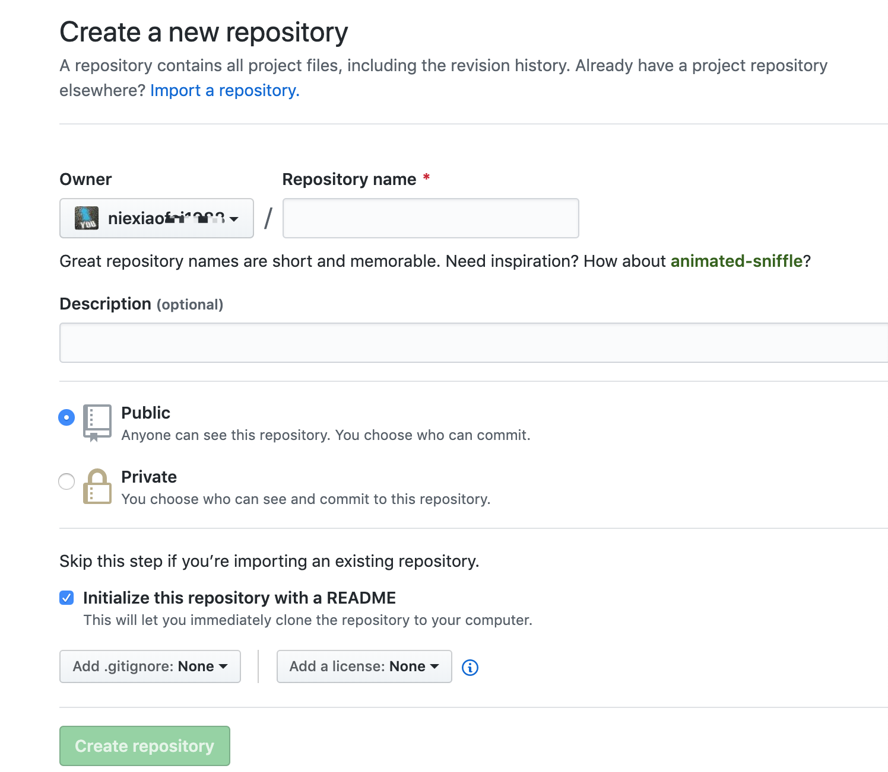
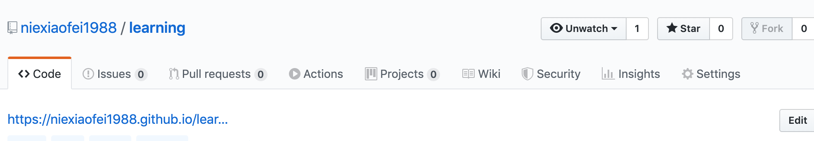
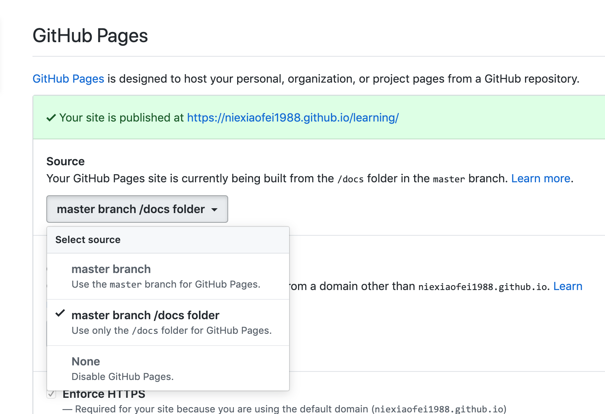

# 如何使用 Github 搭建静态站点 {docsify-ignore}

## 注册创建

> 其实现在有很多静态站点的搭建方式, 可以参考下[静态站点生成器](https://www.staticgen.com/)内有很多种快速构建静态站点的生成器. 随意选一个吧, 目前使用的是 [docsify](https://docsify.js.org/#/), 至于其他的几个也都用过一些, 比如 `Hexo` `Gatsby` `VuePress` 等

- 首先你得有一个 [Github](https://github.com/) 账号, 至于注册嘛,就很简单了, 填写一个邮箱和密码之后收到邮件填入 code 码就可以了

- 登录进入后, 点击新建仓库



- 进入仓库点击, `setting` 配置管理



- 往下翻找到 `Github Page` 项目栏, 默认选择的是 `master branch`, 也可以自己定义创建一个 `gh-pages`分支, 专门用于部署静态站点, 也可以选择 `master`分支下的某一个文件夹



> 其实这里主要依赖的就是 `index.html` 文件, 会作为首页进行访问. 可以是单页面 也可以是多页面, 允许引入其他的 `JS` 和 `css`文件, 当上述操作完成之后就会显示一个可以访问到的地址, 如果是 `404` 需要查看一下是否设置有错误

## 静态构建

> 现如今, 部分静态站点是采用的单页面方式进行访问, 如何利用静态站点生成器创建一个单页面的站点呢 ? 首先先看一下使用 [docsify](https://docsify.js.org/#/) 进行搭建, 一步一步的进行操作, 假设按照创建项目流程新创建一个项目 `blog` 后, `git clone` 到本地之后

### docsify

> `markdown`语法

- `首先全局安装生成器命令`

```bash
npm i docsify-cli -g

# git clone 项目
cd blog

# 初始化文档
docsity init ./docs

# 本地预览
docsify serve docs
```

> 此时初始化时会创建一个 `docs`文件夹, 目录下包含有 `index.html`(将会引入必须要的`js` 和 `css` 文件, 以及后续的`配置项`也在文件中配置), 和一个 `README.md` 文件

- `添加 loading`

> 可能会觉得在网络较差时加载比较慢, 体验不是很好

`index.html`

```html
<!-- 这里的加载中将会在进入页面时, 加载其他文件时显示, 当一切就绪后自动消失, 也可以自定义写样式优化 -->
<div id="app">加载中...</div>
```

- [配置项参考](https://docsify.js.org/#/zh-cn/configuration)

#### 部署到 Github

> 期间无需 `build` 直接可以按照最上方开始的时候, 点击进入 `setting` 配置, 在选择 `Github Page`时的目录文件时, 选择 `master branch docs folder`, 因为这里我们是`init`时的一个 `docs`文件夹

[其他更多部署方式](https://docsify.js.org/#/zh-cn/deploy)

> 到此利用 `docsify`生成器已经可以构建我们自己的静态站点了, 学习使用 `markdown`语法进行编写
