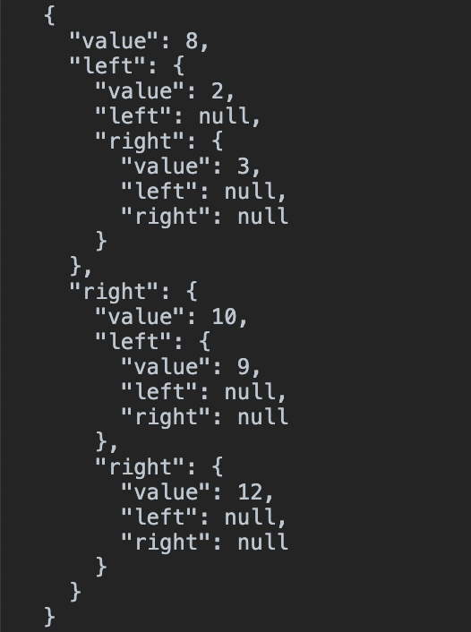

## 树结构 {docsify-ignore}

### 二叉树

> 什么叫二叉树, 在树结构中每个节点都可以有多个子节点, 而二叉树是一种特殊的树结构, 每个节点都只有包含两个子节点

- 小于当前节点值, 则放在节点左侧 `left`
- 大于当前节点值, 则放在节点右侧 `right`

> 如下图所示, 现在只需要关注最终形成的树结构, 根节点是`8` 而小于 `8`的值放在左侧,大于`8`的值放在右侧, 后续插入节点需要遍历执行, 插入位置按照上述所说进行


> 而实现二叉树, 需要有一个辅助类 `Node`表示插入节点的一个实例, 包含有 `value` `left` 和 `right`, 初始化时 `left` 和 `right` 设置为`null` 如下

```js
class BSTreeNode {
  constructor(value) {
    this.value = value;
    this.left = null;
    this.right = null;
  }
}
```

> 现在只是写好了辅助类 `BSTreeNode`, 一个树结构包含一个根节点`root`, 当树为空时, 根节点`root`也为空 `null`, 接卸来就实现以下最初的根节点`root`

```js
// 防止外部进行访问, 可以理解为是一种私有变量的写法
const _root = Symbol("BSTreeRoot");
class BSTree {
  constructor() {
    this[_root] = null;
  }
}
```

> 辅助类和 根节点的设置已经完成, 下面就要了解下大概的功能点, 一个树结构包含哪些基础的操作

| 方法      | 描述         |
| --------- | ------------ |
| `insert`  | 插入节点元素 |
| `find`    | 查找给定值   |
| `findMin` | 查找最小值   |
| `findMax` | 查找最大值   |
| `remove`  | 删除节点元素 |

> 下面就是依次按照功能描述进行编写, 首先的就是插入节点, 大致思路如下

- 当前树若为空, 直接插入, 进入到下一步
- 不为空时, 需要进行判断, 根据上述所说, 依次遍历递归查找到对应的位置进行插入
  - 当前值小于插入值, 放右侧
  - 当前值大于插入值, 放左侧

```js
// 借助一个递归方法
insertNode(oldNode, newNode) {
  if (oldNode.value > newNode.value) {
    if (oldNode.left === null) {
      oldNode.left = newNode;
    } else {
      this.insertNode(oldNode.left, newNode);
    }
  } else if (oldNode.value < newNode.value) {
    if (oldNode.right === null) {
      oldNode.right = newNode;
    } else {
      this.insertNode(oldNode.right, newNode);
    }
  } else {
    console.error("已经存在插入值, 不能重复");
    return this;
  }

  return this;
}

insert(value) {
  const bsTreeNode = new BSTreeNode(value);
  if (this[_root] === null) {
    this[_root] = bsTreeNode;
    return this;
  } else {
    return this.insertNode(this[_root], bsTreeNode);
  }
}
```

> 以上代码呢就已经实现了插入的操作, 然后我们就可以测试一下插入的值, 这里需要一个查看树的方法 `getTree`

```js
getTree() {
  return this[_root];
}
```

> 测试一把看看

```js
const bsTree = new BSTree();
bsTree
  .insert(8)
  .insert(10)
  .insert(12)
  .insert(12);
bsTree.insert(2);
bsTree.insert(3);
bsTree.insert(9);

console.log(JSON.stringify(bsTree.getTree(), null, 2));
```

> 结果如下图所示



> 对树进行查找, 如果查找到对应节点就返回对应节点, 如果查找不到返回 `null`, 查找的主要逻辑就是循环遍历查找的值和当前节点的值, 如果大于当前值就取右侧遍历, 小于当前值就取左侧遍历, 直到查找到为止

```js
 /** 查找指定值的节点元素 */
find(value) {
  if (this[_root] === null) {
    return null;
  }
  let current = this[_root];
  while (current !== null) {
    if (current.value === value) {
      return current;
    }

    if (current.value > value) {
      current = current.left;
    } else if (current.value < value) {
      current = current.right;
    }
  }

  // 循环结束还未查找到 返回 null
  return null;
}
```

> 以下我们需要提供一个快速查找最小值(`min`) 和 最大值(`max`) 的方法, 这两个方法其实和 `find`方法有些类似的, 按照约定, 最小值(`min`)只需要对左侧进行遍历 最大值(`max`)对右侧进行遍历就可以了

```js
/** 最小值 */
findMin() {
  if (this[_root] === null) {
    return null;
  }

  let current = this[_root];
  while (current.left !== null) {
    current = current.left;
  }

  return current.value;
}

/** 最大值 */
findMax() {
  if (this[_root] === null) {
    return null;
  }

  let current = this[_root];
  while (current.right !== null) {
    current = current.right;
  }

  return current.value;
}
```

> 这里我们发现代码其实有很多类似的地方, 且这里只会存在两种方式, 要么是最大要么是最小值, 可以进行合并优化下

```js
findMinAndMax(type) {
  if (this[_root] === null) {
    return null;
  }

  const direction = type === 'min' ? 'left' : 'right';
  let current = this[_root];
  while (current[direction] !== null) {
    current = current[direction];
  }

  return current.value;
}
/** 最小值 */
findMin() {
  return this.findMinAndMax('min');
}

/** 最大值 */
findMax() {
  return this.findMinAndMax("max");
}
```

> 然后接下来就是对节点进行删除了, 删除的话相比较以上的功能就比较麻烦了, 需要考虑的地方比较多

- 如果树为空, 直接`return`
- 删除叶子节点
- 删除只有一个子节点
- 删除有两个子节点

> 主要逻辑就是在查找的过程中一步一步的进行重构树, 且在查找到对应的节点时 直接设置为空`null`

`以下代码实现有Bug`

```js
constructor() {
  this[_root] = null;
  /** 查找当前节点的右侧最小节点 */
  this[_findRightOnRightMin] = function(node) {
    if (node === null) return null;
    let current = node;
    while (current.right) {
      current = current.right;
    }
    return current;
  };
}

/** 删除指定节点 */
remove(value) {
  // 重构树
  this[_root] = this.removeNode(this[_root], value);
}

removeNode(node, value) {
  /** 如果当前节点为空 直接返回 */
  if (node === null) return null;
  /**
   * 1. 判断是否为空, 为空直接返回
   * 2. 判断是否当前节点小于删除节点值, 小于则递归遍历 右侧节点, 大于则递归遍历左侧节点
   * 3. 查找到对应的节点
   *  (1). 如果删除对应节点为叶子节点时, 直接删除即可
   *  (2). 如果删除对应节点包含一个子节点时, 如果是右节点 则设置当前节点为右节点, 如果是左节点, 则设置当前节点为左节点
   *  (3). 如果删除节点包含两个子节点时, 则查找删除节点的右侧最小节点 todo 这里还不是很明白为什么是右侧最小节点, 需要借助图分析
   *
   * 当包含一个节点时, 递归压入调用栈, 直到查找到对应的节点时 递归调用结束, 到最后一个判断内(查找到删除对应的节点位置)
  */
  if (node.value < value) {
    node.right = this.removeNode(node.right, value);
    return node;
  } else if (node.value > value) {
    node.left = this.removeNode(node.left, value);
    return node;
  } else {
    if (node.left === null && node.right === null) {
      /** 叶子节点 */
      node = null;
      return node;
    } else if (node.left === null && node.right) {
      /** 只有右节点 */
      return node.right;
    } else if (node.right === null && node.left) {
      /** 只有左节点 */
      return node.left;
    } else {
      /** 包含有左右两个节点 */
      // todo 此处为什么是查找当前节点右侧最小节点 ? 待学习
      const aux = this[_findRightOnRightMin](node.right);
      node.value = aux.value;
      return node;
    }
  }
}
```

> 最后一个就是遍历, 当业务中需要进行对树进行操作时, 需要提供一个可接受`callback`的遍历方法 `todo`


[完整代码](https://github.com/niexiaofei1988/learning/blob/master/docs/dataStructure/tree/binarySearchTree.js)

### 参考

- [树结构](<https://zh.wikipedia.org/wiki/%E6%A0%91_(%E6%95%B0%E6%8D%AE%E7%BB%93%E6%9E%84)>)
